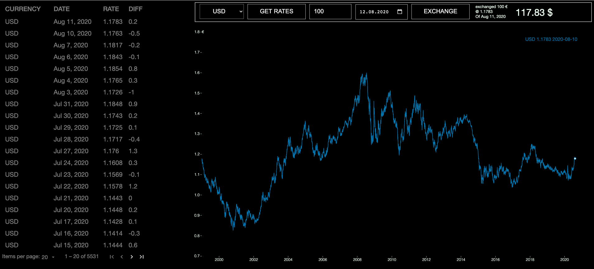

# Java/Angular challenge - speed integration with Bundesbank.

### Front:
* Angular9 - Glues the front-end.
* Material - UI Components
* D3V5 - Js visualisation of currency rate

### Back:
* Gradle - Automates build.
* Spring Boot - Back end core. 
* Spring REST - Rest API
* Swagger - Rest API design and integration available http://localhost:8212/swagger-ui/index.html#/
* H2 DB - in memory Database to save Data
* xjcGenerate - Generates Bundes Bank Schema bbk http://www.bundesbank.de/statistik/zeitreihen/BBKcompact see schema folder for xsd.
* Data - Comes from https://www.bundesbank.de/dynamic/action/de/statistiken/zeitreihen-datenbanken/zeitreihen-datenbank/759778/759778?listId=www_s331_b01012_3 as SDMX-ML XML

TODO: Build/Run steps
